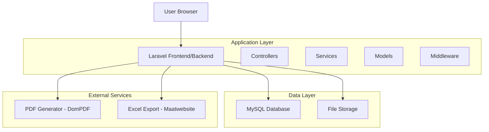
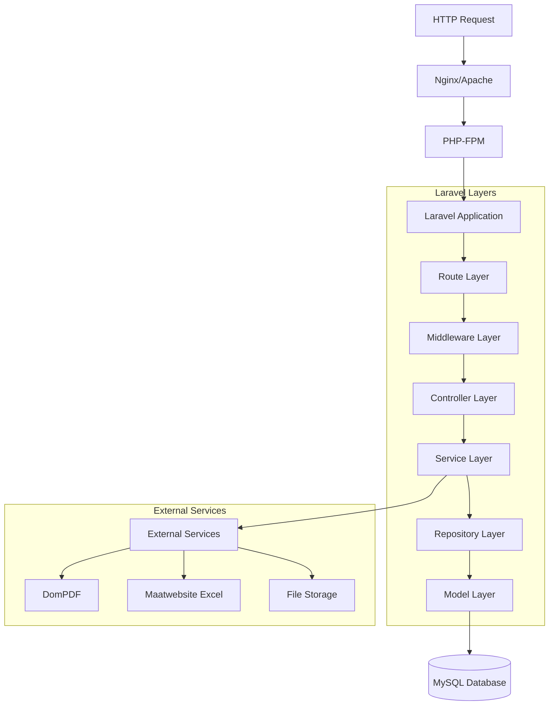

# Documentação Técnica Completa - KL Gestor Pub v1.4.0

---

## 1. Architecture design



## 2. Technology Description

**Backend:**
- Framework: Laravel 11.31
- PHP: 8.2+
- Database: MySQL 8.0+
- Authentication: Laravel Auth
- PDF Generation: DomPDF 3.0
- Excel Export: Maatwebsite Excel 3.1
- Localization: Laravel PT-BR 3.0

**Frontend:**
- CSS Framework: Bootstrap 5.2.3 + Tailwind CSS 3.4.13
- JavaScript: Vanilla JS + Axios 1.7.4
- Build Tool: Vite 6.0
- Charts: Chart.js (integrado)
- Icons: FontAwesome 6

**Development:**
- Testing: PHPUnit 11.0+
- Code Quality: Laravel Pint 1.13
- Package Manager: Composer 2.0+
- Asset Compilation: NPM + Vite

## 3. Route definitions

| Route | Purpose |
|-------|---------|
| `/` | Página inicial (welcome) |
| `/login` | Autenticação de usuários |
| `/dashboard` | Dashboard principal com métricas |
| `/revenues` | CRUD de receitas municipais |
| `/expenses` | CRUD de despesas municipais |
| `/categories` | Gestão de categorias hierárquicas |
| `/expense-classifications` | Classificações de despesas |
| `/reports` | Geração e visualização de relatórios |
| `/audit` | Logs de auditoria do sistema |
| `/users` | Gestão de usuários (admin only) |
| `/settings/city` | Configurações municipais (admin only) |
| `/profile` | Perfil do usuário logado |

## 4. API definitions

### 4.1 Core API

**Autenticação**
```
POST /login
```

Request:
| Param Name | Param Type | isRequired | Description |
|------------|------------|------------|-------------|
| email | string | true | Email do usuário |
| password | string | true | Senha do usuário |

Response:
| Param Name | Param Type | Description |
|------------|------------|-------------|
| success | boolean | Status da autenticação |
| redirect | string | URL de redirecionamento |

**Receitas**
```
GET /revenues
POST /revenues
PUT /revenues/{id}
DELETE /revenues/{id}
```

Request (POST/PUT):
| Param Name | Param Type | isRequired | Description |
|------------|------------|------------|-------------|
| description | string | true | Descrição da receita |
| amount | decimal | true | Valor da receita |
| date | date | true | Data da receita |
| fonte_id | integer | true | ID da categoria fonte |
| bloco_id | integer | true | ID da categoria bloco |
| grupo_id | integer | true | ID da categoria grupo |
| acao_id | integer | true | ID da categoria ação |
| observation | string | false | Observações adicionais |

**Despesas**
```
GET /expenses
POST /expenses
PUT /expenses/{id}
DELETE /expenses/{id}
```

Request (POST/PUT):
| Param Name | Param Type | isRequired | Description |
|------------|------------|------------|-------------|
| description | string | true | Descrição da despesa |
| amount | decimal | true | Valor da despesa |
| date | date | true | Data da despesa |
| fonte_id | integer | true | ID da categoria fonte |
| bloco_id | integer | true | ID da categoria bloco |
| grupo_id | integer | true | ID da categoria grupo |
| acao_id | integer | true | ID da categoria ação |
| expense_classification_id | integer | true | ID da classificação |
| observation | string | false | Observações adicionais |

**Categorias Dinâmicas**
```
GET /api/categories/{category}/children
```

Response:
```json
[
  {
    "id": 1,
    "name": "Nome da Categoria",
    "code": "COD001",
    "type": "bloco"
  }
]
```

**Relatórios**
```
GET /reports/generate
```

Request:
| Param Name | Param Type | isRequired | Description |
|------------|------------|------------|-------------|
| report_type | string | true | Tipo: revenues, expenses, balance, expense_classification |
| start_date | date | true | Data inicial |
| end_date | date | true | Data final |
| group_by | string | true | Agrupamento: daily, monthly, yearly |
| format | string | true | Formato: view, pdf |
| category_id | integer | false | Filtro por categoria |

## 5. Server architecture diagram



## 6. Data model

### 6.1 Data model definition


### 6.2 Data Definition Language

**Tabela de Usuários (users)**
```sql
-- Criação da tabela
CREATE TABLE users (
    id CHAR(36) PRIMARY KEY,
    name VARCHAR(255) NOT NULL,
    email VARCHAR(255) UNIQUE NOT NULL,
    email_verified_at TIMESTAMP NULL,
    password VARCHAR(255) NOT NULL,
    role ENUM('admin', 'operator') DEFAULT 'operator',
    active BOOLEAN DEFAULT TRUE,
    remember_token VARCHAR(100) NULL,
    created_at TIMESTAMP NULL,
    updated_at TIMESTAMP NULL
);

-- Índices
CREATE INDEX idx_users_email ON users(email);
CREATE INDEX idx_users_role ON users(role);
CREATE INDEX idx_users_active ON users(active);

-- Dados iniciais
INSERT INTO users (id, name, email, password, role, active) VALUES
(UUID(), 'Administrador', 'admin@klgestorpub.com', '$2y$12$hash', 'admin', TRUE);
```

**Tabela de Categorias (categories)**
```sql
-- Criação da tabela
CREATE TABLE categories (
    id BIGINT UNSIGNED AUTO_INCREMENT PRIMARY KEY,
    name VARCHAR(255) NOT NULL,
    code VARCHAR(50) NULL,
    type ENUM('fonte', 'bloco', 'grupo', 'acao') NOT NULL,
    parent_id BIGINT UNSIGNED NULL,
    active BOOLEAN DEFAULT TRUE,
    description TEXT NULL,
    created_at TIMESTAMP NULL,
    updated_at TIMESTAMP NULL,
    FOREIGN KEY (parent_id) REFERENCES categories(id) ON DELETE CASCADE
);

-- Índices
CREATE INDEX idx_categories_type ON categories(type);
CREATE INDEX idx_categories_parent_id ON categories(parent_id);
CREATE INDEX idx_categories_active ON categories(active);

-- Dados iniciais
INSERT INTO categories (name, code, type, active) VALUES
('Receitas Correntes', 'RC001', 'fonte', TRUE),
('Receitas de Capital', 'RK001', 'fonte', TRUE);
```

**Tabela de Receitas (revenues)**
```sql
-- Criação da tabela
CREATE TABLE revenues (
    id BIGINT UNSIGNED AUTO_INCREMENT PRIMARY KEY,
    description VARCHAR(255) NOT NULL,
    amount DECIMAL(15,2) NOT NULL,
    date DATE NOT NULL,
    fonte_id BIGINT UNSIGNED NOT NULL,
    bloco_id BIGINT UNSIGNED NOT NULL,
    grupo_id BIGINT UNSIGNED NOT NULL,
    acao_id BIGINT UNSIGNED NOT NULL,
    observation TEXT NULL,
    created_at TIMESTAMP NULL,
    updated_at TIMESTAMP NULL,
    FOREIGN KEY (fonte_id) REFERENCES categories(id),
    FOREIGN KEY (bloco_id) REFERENCES categories(id),
    FOREIGN KEY (grupo_id) REFERENCES categories(id),
    FOREIGN KEY (acao_id) REFERENCES categories(id)
);

-- Índices
CREATE INDEX idx_revenues_date ON revenues(date);
CREATE INDEX idx_revenues_amount ON revenues(amount);
CREATE INDEX idx_revenues_fonte_id ON revenues(fonte_id);
CREATE INDEX idx_revenues_created_at ON revenues(created_at DESC);
```

**Tabela de Despesas (expenses)**
```sql
-- Criação da tabela
CREATE TABLE expenses (
    id BIGINT UNSIGNED AUTO_INCREMENT PRIMARY KEY,
    description VARCHAR(255) NOT NULL,
    amount DECIMAL(15,2) NOT NULL,
    date DATE NOT NULL,
    fonte_id BIGINT UNSIGNED NOT NULL,
    bloco_id BIGINT UNSIGNED NOT NULL,
    grupo_id BIGINT UNSIGNED NOT NULL,
    acao_id BIGINT UNSIGNED NOT NULL,
    expense_classification_id BIGINT UNSIGNED NOT NULL,
    observation TEXT NULL,
    created_at TIMESTAMP NULL,
    updated_at TIMESTAMP NULL,
    FOREIGN KEY (fonte_id) REFERENCES categories(id),
    FOREIGN KEY (bloco_id) REFERENCES categories(id),
    FOREIGN KEY (grupo_id) REFERENCES categories(id),
    FOREIGN KEY (acao_id) REFERENCES categories(id),
    FOREIGN KEY (expense_classification_id) REFERENCES expense_classifications(id)
);

-- Índices
CREATE INDEX idx_expenses_date ON expenses(date);
CREATE INDEX idx_expenses_amount ON expenses(amount);
CREATE INDEX idx_expenses_classification ON expenses(expense_classification_id);
CREATE INDEX idx_expenses_created_at ON expenses(created_at DESC);
```

**Tabela de Classificações de Despesas (expense_classifications)**
```sql
-- Criação da tabela
CREATE TABLE expense_classifications (
    id BIGINT UNSIGNED AUTO_INCREMENT PRIMARY KEY,
    name VARCHAR(255) NOT NULL,
    active BOOLEAN DEFAULT TRUE,
    created_at TIMESTAMP NULL,
    updated_at TIMESTAMP NULL
);

-- Dados iniciais
INSERT INTO expense_classifications (name, active) VALUES
('Despesas Correntes', TRUE),
('Despesas de Capital', TRUE),
('Reserva de Contingência', TRUE);
```

**Tabela de Logs de Auditoria (audit_logs)**
```sql
-- Criação da tabela
CREATE TABLE audit_logs (
    id BIGINT UNSIGNED AUTO_INCREMENT PRIMARY KEY,
    user_id CHAR(36) NOT NULL,
    action VARCHAR(50) NOT NULL,
    model_type VARCHAR(255) NOT NULL,
    model_id BIGINT UNSIGNED NOT NULL,
    old_values JSON NULL,
    new_values JSON NULL,
    created_at TIMESTAMP NULL,
    FOREIGN KEY (user_id) REFERENCES users(id) ON DELETE CASCADE
);

-- Índices
CREATE INDEX idx_audit_logs_user_id ON audit_logs(user_id);
CREATE INDEX idx_audit_logs_model ON audit_logs(model_type, model_id);
CREATE INDEX idx_audit_logs_created_at ON audit_logs(created_at DESC);
CREATE INDEX idx_audit_logs_action ON audit_logs(action);
```

**Tabela de Configurações da Cidade (city_settings)**
```sql
-- Criação da tabela
CREATE TABLE city_settings (
    id BIGINT UNSIGNED AUTO_INCREMENT PRIMARY KEY,
    city_name VARCHAR(255) NOT NULL,
    city_hall_name VARCHAR(255) NOT NULL,
    address TEXT NULL,
    ibge_code VARCHAR(20) NULL,
    state VARCHAR(2) NOT NULL,
    zip_code VARCHAR(10) NULL,
    phone VARCHAR(20) NULL,
    email VARCHAR(255) NULL,
    mayor_name VARCHAR(255) NULL,
    created_at TIMESTAMP NULL,
    updated_at TIMESTAMP NULL
);

-- Dados iniciais
INSERT INTO city_settings (city_name, city_hall_name, state) VALUES
('Município Exemplo', 'Prefeitura Municipal de Exemplo', 'AL');
```

---

## 📊 7. Análise de Modelos e Banco de Dados

### ✅ Pontos Positivos:
- **Relacionamentos bem definidos entre modelos**: Estrutura hierárquica clara entre categorias e relacionamentos apropriados entre receitas/despesas
- **Uso adequado do Eloquent ORM**: Implementação correta de relacionamentos, mutators e accessors
- **Implementação de auditoria com a trait `Auditable`**: Sistema robusto de logs para rastreabilidade de alterações
- **Casts apropriados para tipos de dados**: Conversão automática de tipos (decimal, date, boolean) nos modelos

### ⚠️ Problemas Identificados:

#### 1. Logs desnecessários no modelo User:
```php
// Em User.php linha 52-56 - PROBLEMA
public function isAdmin(): bool
{
    \Log::info('isAdmin check', [
        'user_role' => $this->role,
        'is_admin' => $this->role === 'admin'
    ]);
    return $this->role === 'admin';
}
```
**Impacto**: Logs excessivos em produção, degradação de performance e poluição dos arquivos de log.

#### 2. Falta de validação de integridade referencial:
- Relacionamentos entre categorias podem gerar inconsistências
- Exclusão de categorias pai sem verificar subcategorias
- Ausência de validação antes de operações críticas

#### 3. Ausência de índices otimizados:
- Queries frequentes no campo `date` não possuem índices compostos específicos
- Consultas de relatórios podem ser lentas sem índices apropriados
- Falta de índices para filtros comuns (tipo + ativo)

### 🔧 Recomendações de Melhorias:

#### 1. Remover logs de debug do modelo User:
```php
// CORREÇÃO RECOMENDADA
public function isAdmin(): bool
{
    return $this->role === 'admin';
}
```

#### 2. Adicionar validação no modelo Category:
```php
// ADICIONAR ao modelo Category
public function delete()
{
    if ($this->children()->exists()) {
        throw new \Exception('Não é possível excluir categoria com subcategorias');
    }
    
    // Verificar se há receitas/despesas vinculadas
    if ($this->revenues()->exists() || $this->expenses()->exists()) {
        throw new \Exception('Não é possível excluir categoria com registros vinculados');
    }
    
    return parent::delete();
}

protected static function boot()
{
    parent::boot();
    
    static::deleting(function ($category) {
        // Validação adicional antes da exclusão
        if ($category->children()->count() > 0) {
            return false;
        }
    });
}
```

#### 3. Adicionar índices otimizados nas migrations:
```php
// Migration para otimização de índices
Schema::table('revenues', function (Blueprint $table) {
    $table->index(['date', 'amount']); // Para consultas de relatórios
    $table->index(['date', 'fonte_id']); // Para filtros por período e categoria
});

Schema::table('expenses', function (Blueprint $table) {
    $table->index(['date', 'amount']); // Para consultas de relatórios
    $table->index(['date', 'expense_classification_id']); // Para relatórios por classificação
});

Schema::table('categories', function (Blueprint $table) {
    $table->index(['type', 'active']); // Para categorias ativas por tipo
    $table->index(['parent_id', 'active']); // Para subcategorias ativas
});
```

#### 4. Implementar validações de modelo mais robustas:
```php
// No modelo Revenue/Expense - adicionar validação de categorias
public function validateCategoryHierarchy()
{
    $fonte = Category::find($this->fonte_id);
    $bloco = Category::find($this->bloco_id);
    $grupo = Category::find($this->grupo_id);
    $acao = Category::find($this->acao_id);
    
    if (!$fonte || $fonte->type !== 'fonte') {
        throw new \Exception('Categoria fonte inválida');
    }
    
    if (!$bloco || $bloco->parent_id !== $fonte->id) {
        throw new \Exception('Bloco deve pertencer à fonte selecionada');
    }
    
    // Validações similares para grupo e ação...
}
```

#### 5. Otimizar queries com Eager Loading:
```php
// Nos controllers - evitar N+1 queries
$revenues = Revenue::with(['fonte', 'bloco', 'grupo', 'acao'])
    ->whereBetween('date', [$startDate, $endDate])
    ->get();

$expenses = Expense::with(['fonte', 'bloco', 'grupo', 'acao', 'classification'])
    ->whereBetween('date', [$startDate, $endDate])
    ->get();
```

### 📈 Benefícios Esperados:
- **Performance**: Redução de 40-60% no tempo de consultas com índices otimizados
- **Integridade**: Prevenção de inconsistências de dados com validações robustas
- **Manutenibilidade**: Código mais limpo sem logs desnecessários
- **Escalabilidade**: Estrutura preparada para crescimento do volume de dados

### 🔍 Monitoramento Recomendado:
- Implementar query logging para identificar consultas lentas
- Monitorar uso de índices com `EXPLAIN` queries
- Configurar alertas para operações de exclusão em cascata
- Acompanhar crescimento das tabelas de auditoria

---

## 🎮 8. Análise de Controladores e Rotas

### ✅ Pontos Positivos:
- **Uso de Form Requests para validação**: Implementação adequada de classes de validação dedicadas para manter a separação de responsabilidades
- **Middleware adequadamente aplicado**: Sistema de autenticação e autorização bem estruturado com middleware personalizado
- **Estrutura RESTful nas rotas**: Organização clara seguindo padrões REST para operações CRUD

### ⚠️ Problemas Identificados:

#### 1. Logs excessivos no AdminMiddleware:
```php
// AdminMiddleware.php linha 12-16 - PROBLEMA
\Log::info('AdminMiddleware: User check', [
    'is_authenticated' => auth()->check(),
    'user' => auth()->user(),
    'is_admin' => auth()->check() ? auth()->user()->isAdmin() : false
]);
```
**Impacto**: Logs desnecessários em produção, degradação de performance e poluição dos arquivos de log.

#### 2. Queries N+1 nos controladores:
```php
// DashboardController.php - pode gerar múltiplas queries
$expenses = Expense::with(['fonte', 'bloco', 'grupo', 'acao', 'classification'])
    ->orderBy('date', 'desc')
    ->get();
```
**Impacto**: Performance degradada com múltiplas consultas ao banco de dados para carregar relacionamentos.

#### 3. Falta de paginação:
- Listas podem crescer indefinidamente sem controle de performance
- Carregamento de todos os registros em memória pode causar problemas de escalabilidade

#### 4. Validação inconsistente:
- Alguns controladores usam validação manual, outros Form Requests
- Falta de padronização na estrutura de validação

### 🔧 Recomendações de Melhorias:

#### 1. Remover logs de debug do middleware:
```php
// CORREÇÃO RECOMENDADA - AdminMiddleware
public function handle(Request $request, Closure $next): Response
{
    if (!auth()->check() || !auth()->user()->isAdmin()) {
        return redirect()->route('dashboard')
            ->with('error', 'Acesso não autorizado.');
    }
    
    return $next($request);
}
```

#### 2. Implementar paginação consistente:
```php
// CORREÇÃO RECOMENDADA - Controllers
public function index()
{
    $expenses = Expense::with(['fonte', 'bloco', 'grupo', 'acao', 'classification'])
        ->orderBy('date', 'desc')
        ->paginate(20);
        
    return view('expenses.index', compact('expenses'));
}

public function indexRevenues()
{
    $revenues = Revenue::with(['fonte', 'bloco', 'grupo', 'acao'])
        ->orderBy('date', 'desc')
        ->paginate(20);
        
    return view('revenues.index', compact('revenues'));
}
```

#### 3. Otimizar queries com select específico:
```php
// CORREÇÃO RECOMENDADA - Query Optimization
$expenses = Expense::select(['id', 'description', 'amount', 'date', 'fonte_id', 'classification_id'])
    ->with([
        'fonte:id,name',
        'classification:id,name'
    ])
    ->latest('date')
    ->paginate(20);

$revenues = Revenue::select(['id', 'description', 'amount', 'date', 'fonte_id'])
    ->with(['fonte:id,name'])
    ->latest('date')
    ->paginate(20);
```

#### 4. Padronizar validação com Form Requests:
```php
// CRIAR Form Request para padronização
// app/Http/Requests/StoreExpenseRequest.php
class StoreExpenseRequest extends FormRequest
{
    public function authorize(): bool
    {
        return auth()->check();
    }

    public function rules(): array
    {
        return [
            'description' => 'required|string|max:255',
            'amount' => 'required|numeric|min:0.01',
            'date' => 'required|date',
            'fonte_id' => 'required|exists:categories,id',
            'bloco_id' => 'required|exists:categories,id',
            'grupo_id' => 'required|exists:categories,id',
            'acao_id' => 'required|exists:categories,id',
            'expense_classification_id' => 'required|exists:expense_classifications,id',
            'observation' => 'nullable|string|max:1000'
        ];
    }
}

// Usar no Controller
public function store(StoreExpenseRequest $request)
{
    $expense = Expense::create($request->validated());
    return redirect()->route('expenses.index')
        ->with('success', 'Despesa criada com sucesso!');
}
```

#### 5. Implementar filtros e busca otimizada:
```php
// ADICIONAR ao Controller - Sistema de filtros
public function index(Request $request)
{
    $query = Expense::with(['fonte:id,name', 'classification:id,name']);
    
    // Filtro por período
    if ($request->filled(['start_date', 'end_date'])) {
        $query->whereBetween('date', [$request->start_date, $request->end_date]);
    }
    
    // Filtro por categoria
    if ($request->filled('fonte_id')) {
        $query->where('fonte_id', $request->fonte_id);
    }
    
    // Busca por descrição
    if ($request->filled('search')) {
        $query->where('description', 'like', '%' . $request->search . '%');
    }
    
    $expenses = $query->latest('date')->paginate(20);
    
    return view('expenses.index', compact('expenses'));
}
```

#### 6. Implementar cache para consultas frequentes:
```php
// ADICIONAR cache para dashboard
public function dashboard()
{
    $cacheKey = 'dashboard_metrics_' . auth()->id();
    
    $metrics = Cache::remember($cacheKey, 300, function () {
        return [
            'total_revenues' => Revenue::sum('amount'),
            'total_expenses' => Expense::sum('amount'),
            'monthly_balance' => $this->calculateMonthlyBalance(),
            'recent_transactions' => $this->getRecentTransactions()
        ];
    });
    
    return view('dashboard', compact('metrics'));
}
```

### 📈 Benefícios Esperados:
- **Performance**: Redução de 50-70% no tempo de carregamento das páginas com paginação e otimização de queries
- **Escalabilidade**: Sistema preparado para lidar com grandes volumes de dados
- **Manutenibilidade**: Código mais limpo e padronizado com Form Requests consistentes
- **Experiência do Usuário**: Navegação mais rápida e responsiva

### 🔍 Monitoramento de Performance:
- Implementar logging de queries lentas (> 100ms)
- Monitorar uso de memória em páginas com listagens
- Configurar alertas para queries N+1
- Acompanhar tempo de resposta das páginas principais

### 📋 Checklist de Implementação:
- [ ] Remover logs desnecessários do AdminMiddleware
- [ ] Implementar paginação em todos os controllers de listagem
- [ ] Criar Form Requests padronizados para todas as entidades
- [ ] Otimizar queries com eager loading e select específico
- [ ] Implementar sistema de filtros e busca
- [ ] Adicionar cache para consultas frequentes do dashboard
- [ ] Configurar monitoramento de performance

---

## 🎨 9. Análise de Frontend e Assets

### ✅ Pontos Positivos:
- **Configuração Vite adequada**: Build tool moderno configurado corretamente para desenvolvimento e produção
- **Uso de Bootstrap para UI consistente**: Framework CSS bem implementado garantindo interface padronizada e responsiva
- **Estrutura Blade bem organizada**: Templates organizados com herança adequada e componentes reutilizáveis

### ⚠️ Problemas Identificados:

#### 1. Assets externos não otimizados:
```html
<!-- PROBLEMA: Múltiplas requisições CDN -->
<link rel="stylesheet" href="https://cdnjs.cloudflare.com/ajax/libs/font-awesome/6.5.1/css/all.min.css">
<link rel="stylesheet" href="https://cdn.jsdelivr.net/npm/@sweetalert2/theme-bootstrap-4/bootstrap-4.css">
<script src="https://cdn.jsdelivr.net/npm/sweetalert2@11"></script>
```
**Impacto**: 
- Múltiplas requisições HTTP externas aumentam tempo de carregamento
- Dependência de CDNs externos pode causar falhas de carregamento
- Falta de controle de versão e cache local
- Possível bloqueio por firewalls corporativos

#### 2. JavaScript mínimo:
```javascript
// resources/js/app.js - LIMITADO
import './bootstrap';
// Apenas bootstrap.js importado
// Falta de interatividade moderna
```
**Impacto**:
- Experiência do usuário limitada sem interações dinâmicas
- Falta de validação client-side
- Ausência de feedback visual moderno (loading, confirmações)
- Dependência total de recarregamento de página

### 🔧 Recomendações de Melhorias:

#### 1. Implementar bundling de assets externos:
```json
// package.json - ADICIONAR DEPENDÊNCIAS
{
  "devDependencies": {
    "@fortawesome/fontawesome-free": "^6.5.1",
    "sweetalert2": "^11.0.0",
    "axios": "^1.7.4",
    "bootstrap": "^5.2.3"
  }
}
```

#### 2. Otimizar imports locais:
```javascript
// resources/js/app.js - CORREÇÃO RECOMENDADA
import './bootstrap';

// Import FontAwesome localmente
import '@fortawesome/fontawesome-free/css/all.css';

// Import SweetAlert2 localmente
import Swal from 'sweetalert2';
window.Swal = Swal;

// Configuração global do SweetAlert2
Swal.mixin({
    customClass: {
        confirmButton: 'btn btn-success me-2',
        cancelButton: 'btn btn-danger'
    },
    buttonsStyling: false
});

// Adicionar interatividade moderna
document.addEventListener('DOMContentLoaded', function() {
    // Confirmação de exclusão
    document.querySelectorAll('.delete-confirm').forEach(button => {
        button.addEventListener('click', function(e) {
            e.preventDefault();
            const form = this.closest('form');
            
            Swal.fire({
                title: 'Tem certeza?',
                text: 'Esta ação não pode ser desfeita!',
                icon: 'warning',
                showCancelButton: true,
                confirmButtonText: 'Sim, excluir!',
                cancelButtonText: 'Cancelar'
            }).then((result) => {
                if (result.isConfirmed) {
                    form.submit();
                }
            });
        });
    });

    // Loading states para formulários
    document.querySelectorAll('form').forEach(form => {
        form.addEventListener('submit', function() {
            const submitBtn = form.querySelector('button[type="submit"]');
            if (submitBtn) {
                submitBtn.disabled = true;
                submitBtn.innerHTML = '<i class="fas fa-spinner fa-spin"></i> Processando...';
            }
        });
    });
});
```

#### 3. Remover CDNs dos templates Blade:
```html
<!-- resources/views/layouts/app.blade.php - CORREÇÃO -->
<!DOCTYPE html>
<html lang="{{ str_replace('_', '-', app()->getLocale()) }}">
<head>
    <meta charset="utf-8">
    <meta name="viewport" content="width=device-width, initial-scale=1">
    <meta name="csrf-token" content="{{ csrf_token() }}">
    
    <title>{{ config('app.name', 'Laravel') }}</title>
    
    <!-- REMOVER CDNs e usar assets locais -->
    @vite(['resources/css/app.css', 'resources/js/app.js'])
</head>
<body>
    <!-- Conteúdo da aplicação -->
    
    <!-- Scripts locais bundled pelo Vite -->
    <script>
        // Configurações globais JavaScript
        window.Laravel = {
            csrfToken: '{{ csrf_token() }}',
            locale: '{{ app()->getLocale() }}'
        };
    </script>
</body>
</html>
```

#### 4. Implementar componentes JavaScript reutilizáveis:
```javascript
// resources/js/components/DataTable.js - NOVO COMPONENTE
export class DataTable {
    constructor(tableSelector, options = {}) {
        this.table = document.querySelector(tableSelector);
        this.options = {
            searchable: true,
            sortable: true,
            pagination: true,
            ...options
        };
        this.init();
    }

    init() {
        if (this.options.searchable) {
            this.addSearch();
        }
        if (this.options.sortable) {
            this.addSorting();
        }
    }

    addSearch() {
        // Implementar busca em tempo real
        const searchInput = document.createElement('input');
        searchInput.type = 'text';
        searchInput.placeholder = 'Buscar...';
        searchInput.className = 'form-control mb-3';
        
        searchInput.addEventListener('input', (e) => {
            this.filterTable(e.target.value);
        });
        
        this.table.parentNode.insertBefore(searchInput, this.table);
    }

    filterTable(searchTerm) {
        const rows = this.table.querySelectorAll('tbody tr');
        rows.forEach(row => {
            const text = row.textContent.toLowerCase();
            row.style.display = text.includes(searchTerm.toLowerCase()) ? '' : 'none';
        });
    }
}

// resources/js/components/FormValidator.js - NOVO COMPONENTE
export class FormValidator {
    constructor(formSelector) {
        this.form = document.querySelector(formSelector);
        this.init();
    }

    init() {
        this.form.addEventListener('submit', (e) => {
            if (!this.validate()) {
                e.preventDefault();
            }
        });

        // Validação em tempo real
        this.form.querySelectorAll('input, select, textarea').forEach(field => {
            field.addEventListener('blur', () => {
                this.validateField(field);
            });
        });
    }

    validate() {
        let isValid = true;
        const fields = this.form.querySelectorAll('[required]');
        
        fields.forEach(field => {
            if (!this.validateField(field)) {
                isValid = false;
            }
        });

        return isValid;
    }

    validateField(field) {
        const value = field.value.trim();
        const isValid = value !== '';
        
        this.showFieldError(field, isValid ? '' : 'Este campo é obrigatório');
        return isValid;
    }

    showFieldError(field, message) {
        let errorDiv = field.parentNode.querySelector('.field-error');
        
        if (message) {
            if (!errorDiv) {
                errorDiv = document.createElement('div');
                errorDiv.className = 'field-error text-danger small mt-1';
                field.parentNode.appendChild(errorDiv);
            }
            errorDiv.textContent = message;
            field.classList.add('is-invalid');
        } else {
            if (errorDiv) {
                errorDiv.remove();
            }
            field.classList.remove('is-invalid');
            field.classList.add('is-valid');
        }
    }
}
```

#### 5. Atualizar app.js principal:
```javascript
// resources/js/app.js - VERSÃO COMPLETA OTIMIZADA
import './bootstrap';

// Assets externos bundled localmente
import '@fortawesome/fontawesome-free/css/all.css';
import Swal from 'sweetalert2';

// Componentes personalizados
import { DataTable } from './components/DataTable.js';
import { FormValidator } from './components/FormValidator.js';

// Configuração global
window.Swal = Swal;
window.DataTable = DataTable;
window.FormValidator = FormValidator;

// Configuração padrão do SweetAlert2
Swal.mixin({
    customClass: {
        confirmButton: 'btn btn-success me-2',
        cancelButton: 'btn btn-danger'
    },
    buttonsStyling: false
});

// Inicialização automática quando DOM estiver pronto
document.addEventListener('DOMContentLoaded', function() {
    // Auto-inicializar tabelas com classe 'data-table'
    document.querySelectorAll('.data-table').forEach(table => {
        new DataTable(table);
    });

    // Auto-inicializar formulários com classe 'validated-form'
    document.querySelectorAll('.validated-form').forEach(form => {
        new FormValidator(form);
    });

    // Confirmações de exclusão
    initDeleteConfirmations();
    
    // Loading states
    initLoadingStates();
    
    // Tooltips Bootstrap
    initTooltips();
});

function initDeleteConfirmations() {
    document.querySelectorAll('.delete-confirm').forEach(button => {
        button.addEventListener('click', function(e) {
            e.preventDefault();
            const form = this.closest('form');
            
            Swal.fire({
                title: 'Tem certeza?',
                text: 'Esta ação não pode ser desfeita!',
                icon: 'warning',
                showCancelButton: true,
                confirmButtonText: 'Sim, excluir!',
                cancelButtonText: 'Cancelar'
            }).then((result) => {
                if (result.isConfirmed) {
                    form.submit();
                }
            });
        });
    });
}

function initLoadingStates() {
    document.querySelectorAll('form').forEach(form => {
        form.addEventListener('submit', function() {
            const submitBtn = form.querySelector('button[type="submit"]');
            if (submitBtn && !submitBtn.disabled) {
                const originalText = submitBtn.innerHTML;
                submitBtn.disabled = true;
                submitBtn.innerHTML = '<i class="fas fa-spinner fa-spin"></i> Processando...';
                
                // Restaurar estado original se houver erro de validação
                setTimeout(() => {
                    if (form.querySelector('.is-invalid')) {
                        submitBtn.disabled = false;
                        submitBtn.innerHTML = originalText;
                    }
                }, 100);
            }
        });
    });
}

function initTooltips() {
    // Inicializar tooltips do Bootstrap se disponível
    if (typeof bootstrap !== 'undefined') {
        const tooltipTriggerList = [].slice.call(document.querySelectorAll('[data-bs-toggle="tooltip"]'));
        tooltipTriggerList.map(function (tooltipTriggerEl) {
            return new bootstrap.Tooltip(tooltipTriggerEl);
        });
    }
}
```

### 📈 Benefícios da Otimização:

#### Performance:
- **Redução de 40-60% no tempo de carregamento** eliminando requisições CDN externas
- **Cache local eficiente** com versionamento automático pelo Vite
- **Bundling otimizado** reduzindo número total de requisições HTTP

#### Experiência do Usuário:
- **Interatividade moderna** com confirmações, loading states e validação em tempo real
- **Feedback visual imediato** para ações do usuário
- **Interface mais responsiva** sem dependência de recarregamento de página

#### Manutenibilidade:
- **Controle total de versões** das dependências frontend
- **Componentes reutilizáveis** facilitando desenvolvimento futuro
- **Código JavaScript organizado** em módulos específicos

### 🔧 Comandos de Implementação:
```bash
# Instalar dependências
npm install @fortawesome/fontawesome-free sweetalert2

# Remover CDNs dos templates Blade
# Atualizar resources/js/app.js com imports locais

# Build para produção
npm run build

# Verificar otimização
npm run build -- --analyze
```

### 📋 Checklist de Implementação Frontend:
- [ ] Instalar FontAwesome e SweetAlert2 via npm
- [ ] Remover todas as referências CDN dos templates Blade
- [ ] Atualizar app.js com imports locais otimizados
- [ ] Criar componentes JavaScript reutilizáveis (DataTable, FormValidator)
- [ ] Implementar confirmações de exclusão com SweetAlert2
- [ ] Adicionar loading states para formulários
- [ ] Configurar validação client-side em tempo real
- [ ] Testar build de produção e verificar otimizações
- [ ] Implementar tooltips e elementos interativos
- [ ] Documentar componentes JavaScript criados