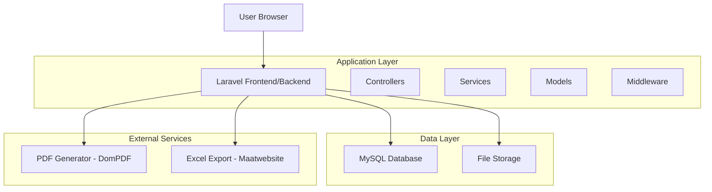
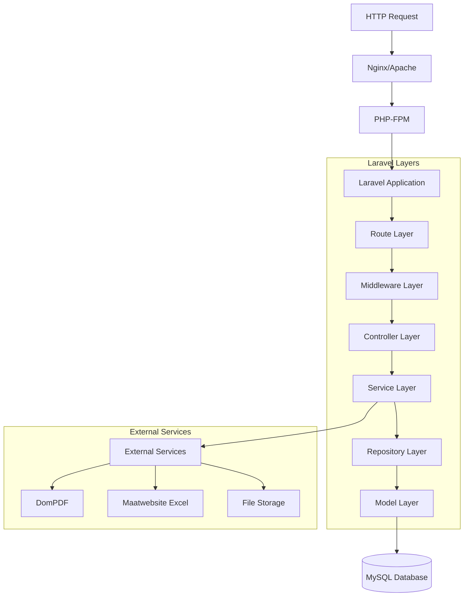
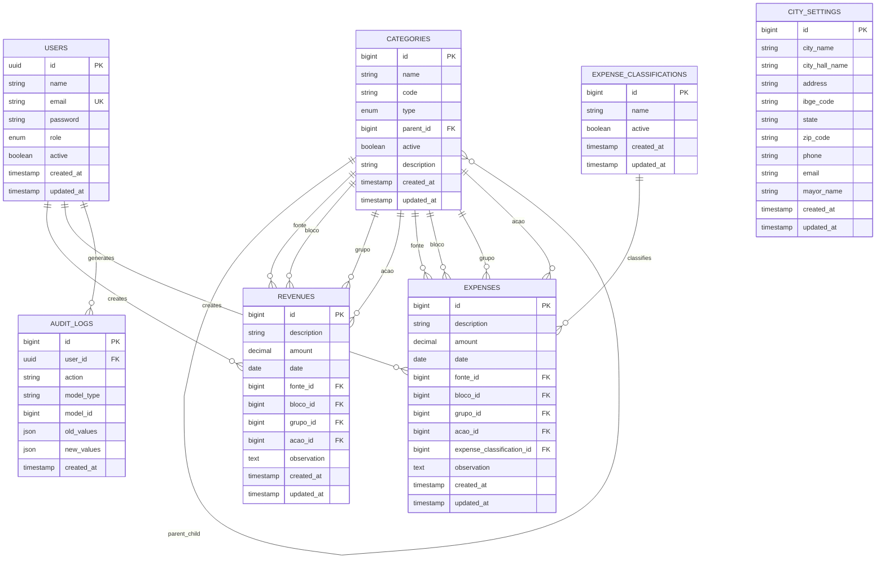

# Documentação Técnica Completa - KL Gestor Pub v1.4.0

---

## 1. Architecture design



## 2. Technology Description

**Backend:**
- Framework: Laravel 11.31
- PHP: 8.2+
- Database: MySQL 8.0+
- Authentication: Laravel Auth
- PDF Generation: DomPDF 3.0
- Excel Export: Maatwebsite Excel 3.1
- Localization: Laravel PT-BR 3.0

**Frontend:**
- CSS Framework: Bootstrap 5.2.3 + Tailwind CSS 3.4.13
- JavaScript: Vanilla JS + Axios 1.7.4
- Build Tool: Vite 6.0
- Charts: Chart.js (integrado)
- Icons: FontAwesome 6

**Development:**
- Testing: PHPUnit 11.0+
- Code Quality: Laravel Pint 1.13
- Package Manager: Composer 2.0+
- Asset Compilation: NPM + Vite

## 3. Route definitions

| Route | Purpose |
|-------|---------|
| `/` | Página inicial (welcome) |
| `/login` | Autenticação de usuários |
| `/dashboard` | Dashboard principal com métricas |
| `/revenues` | CRUD de receitas municipais |
| `/expenses` | CRUD de despesas municipais |
| `/categories` | Gestão de categorias hierárquicas |
| `/expense-classifications` | Classificações de despesas |
| `/reports` | Geração e visualização de relatórios |
| `/audit` | Logs de auditoria do sistema |
| `/users` | Gestão de usuários (admin only) |
| `/settings/city` | Configurações municipais (admin only) |
| `/profile` | Perfil do usuário logado |

## 4. API definitions

### 4.1 Core API

**Autenticação**
```
POST /login
```

Request:
| Param Name | Param Type | isRequired | Description |
|------------|------------|------------|-------------|
| email | string | true | Email do usuário |
| password | string | true | Senha do usuário |

Response:
| Param Name | Param Type | Description |
|------------|------------|-------------|
| success | boolean | Status da autenticação |
| redirect | string | URL de redirecionamento |

**Receitas**
```
GET /revenues
POST /revenues
PUT /revenues/{id}
DELETE /revenues/{id}
```

Request (POST/PUT):
| Param Name | Param Type | isRequired | Description |
|------------|------------|------------|-------------|
| description | string | true | Descrição da receita |
| amount | decimal | true | Valor da receita |
| date | date | true | Data da receita |
| fonte_id | integer | true | ID da categoria fonte |
| bloco_id | integer | true | ID da categoria bloco |
| grupo_id | integer | true | ID da categoria grupo |
| acao_id | integer | true | ID da categoria ação |
| observation | string | false | Observações adicionais |

**Despesas**
```
GET /expenses
POST /expenses
PUT /expenses/{id}
DELETE /expenses/{id}
```

Request (POST/PUT):
| Param Name | Param Type | isRequired | Description |
|------------|------------|------------|-------------|
| description | string | true | Descrição da despesa |
| amount | decimal | true | Valor da despesa |
| date | date | true | Data da despesa |
| fonte_id | integer | true | ID da categoria fonte |
| bloco_id | integer | true | ID da categoria bloco |
| grupo_id | integer | true | ID da categoria grupo |
| acao_id | integer | true | ID da categoria ação |
| expense_classification_id | integer | true | ID da classificação |
| observation | string | false | Observações adicionais |

**Categorias Dinâmicas**
```
GET /api/categories/{category}/children
```

Response:
```json
[
  {
    "id": 1,
    "name": "Nome da Categoria",
    "code": "COD001",
    "type": "bloco"
  }
]
```

**Relatórios**
```
GET /reports/generate
```

Request:
| Param Name | Param Type | isRequired | Description |
|------------|------------|------------|-------------|
| report_type | string | true | Tipo: revenues, expenses, balance, expense_classification |
| start_date | date | true | Data inicial |
| end_date | date | true | Data final |
| group_by | string | true | Agrupamento: daily, monthly, yearly |
| format | string | true | Formato: view, pdf |
| category_id | integer | false | Filtro por categoria |

## 5. Server architecture diagram



## 6. Data model

### 6.1 Data model definition



### 6.2 Data Definition Language

**Tabela de Usuários (users)**
```sql
-- Criação da tabela
CREATE TABLE users (
    id CHAR(36) PRIMARY KEY,
    name VARCHAR(255) NOT NULL,
    email VARCHAR(255) UNIQUE NOT NULL,
    email_verified_at TIMESTAMP NULL,
    password VARCHAR(255) NOT NULL,
    role ENUM('admin', 'operator') DEFAULT 'operator',
    active BOOLEAN DEFAULT TRUE,
    remember_token VARCHAR(100) NULL,
    created_at TIMESTAMP NULL,
    updated_at TIMESTAMP NULL
);

-- Índices
CREATE INDEX idx_users_email ON users(email);
CREATE INDEX idx_users_role ON users(role);
CREATE INDEX idx_users_active ON users(active);

-- Dados iniciais
INSERT INTO users (id, name, email, password, role, active) VALUES
(UUID(), 'Administrador', 'admin@klgestorpub.com', '$2y$12$hash', 'admin', TRUE);
```

**Tabela de Categorias (categories)**
```sql
-- Criação da tabela
CREATE TABLE categories (
    id BIGINT UNSIGNED AUTO_INCREMENT PRIMARY KEY,
    name VARCHAR(255) NOT NULL,
    code VARCHAR(50) NULL,
    type ENUM('fonte', 'bloco', 'grupo', 'acao') NOT NULL,
    parent_id BIGINT UNSIGNED NULL,
    active BOOLEAN DEFAULT TRUE,
    description TEXT NULL,
    created_at TIMESTAMP NULL,
    updated_at TIMESTAMP NULL,
    FOREIGN KEY (parent_id) REFERENCES categories(id) ON DELETE CASCADE
);

-- Índices
CREATE INDEX idx_categories_type ON categories(type);
CREATE INDEX idx_categories_parent_id ON categories(parent_id);
CREATE INDEX idx_categories_active ON categories(active);

-- Dados iniciais
INSERT INTO categories (name, code, type, active) VALUES
('Receitas Correntes', 'RC001', 'fonte', TRUE),
('Receitas de Capital', 'RK001', 'fonte', TRUE);
```

**Tabela de Receitas (revenues)**
```sql
-- Criação da tabela
CREATE TABLE revenues (
    id BIGINT UNSIGNED AUTO_INCREMENT PRIMARY KEY,
    description VARCHAR(255) NOT NULL,
    amount DECIMAL(15,2) NOT NULL,
    date DATE NOT NULL,
    fonte_id BIGINT UNSIGNED NOT NULL,
    bloco_id BIGINT UNSIGNED NOT NULL,
    grupo_id BIGINT UNSIGNED NOT NULL,
    acao_id BIGINT UNSIGNED NOT NULL,
    observation TEXT NULL,
    created_at TIMESTAMP NULL,
    updated_at TIMESTAMP NULL,
    FOREIGN KEY (fonte_id) REFERENCES categories(id),
    FOREIGN KEY (bloco_id) REFERENCES categories(id),
    FOREIGN KEY (grupo_id) REFERENCES categories(id),
    FOREIGN KEY (acao_id) REFERENCES categories(id)
);

-- Índices
CREATE INDEX idx_revenues_date ON revenues(date);
CREATE INDEX idx_revenues_amount ON revenues(amount);
CREATE INDEX idx_revenues_fonte_id ON revenues(fonte_id);
CREATE INDEX idx_revenues_created_at ON revenues(created_at DESC);
```

**Tabela de Despesas (expenses)**
```sql
-- Criação da tabela
CREATE TABLE expenses (
    id BIGINT UNSIGNED AUTO_INCREMENT PRIMARY KEY,
    description VARCHAR(255) NOT NULL,
    amount DECIMAL(15,2) NOT NULL,
    date DATE NOT NULL,
    fonte_id BIGINT UNSIGNED NOT NULL,
    bloco_id BIGINT UNSIGNED NOT NULL,
    grupo_id BIGINT UNSIGNED NOT NULL,
    acao_id BIGINT UNSIGNED NOT NULL,
    expense_classification_id BIGINT UNSIGNED NOT NULL,
    observation TEXT NULL,
    created_at TIMESTAMP NULL,
    updated_at TIMESTAMP NULL,
    FOREIGN KEY (fonte_id) REFERENCES categories(id),
    FOREIGN KEY (bloco_id) REFERENCES categories(id),
    FOREIGN KEY (grupo_id) REFERENCES categories(id),
    FOREIGN KEY (acao_id) REFERENCES categories(id),
    FOREIGN KEY (expense_classification_id) REFERENCES expense_classifications(id)
);

-- Índices
CREATE INDEX idx_expenses_date ON expenses(date);
CREATE INDEX idx_expenses_amount ON expenses(amount);
CREATE INDEX idx_expenses_classification ON expenses(expense_classification_id);
CREATE INDEX idx_expenses_created_at ON expenses(created_at DESC);
```

**Tabela de Classificações de Despesas (expense_classifications)**
```sql
-- Criação da tabela
CREATE TABLE expense_classifications (
    id BIGINT UNSIGNED AUTO_INCREMENT PRIMARY KEY,
    name VARCHAR(255) NOT NULL,
    active BOOLEAN DEFAULT TRUE,
    created_at TIMESTAMP NULL,
    updated_at TIMESTAMP NULL
);

-- Dados iniciais
INSERT INTO expense_classifications (name, active) VALUES
('Despesas Correntes', TRUE),
('Despesas de Capital', TRUE),
('Reserva de Contingência', TRUE);
```

**Tabela de Logs de Auditoria (audit_logs)**
```sql
-- Criação da tabela
CREATE TABLE audit_logs (
    id BIGINT UNSIGNED AUTO_INCREMENT PRIMARY KEY,
    user_id CHAR(36) NOT NULL,
    action VARCHAR(50) NOT NULL,
    model_type VARCHAR(255) NOT NULL,
    model_id BIGINT UNSIGNED NOT NULL,
    old_values JSON NULL,
    new_values JSON NULL,
    created_at TIMESTAMP NULL,
    FOREIGN KEY (user_id) REFERENCES users(id) ON DELETE CASCADE
);

-- Índices
CREATE INDEX idx_audit_logs_user_id ON audit_logs(user_id);
CREATE INDEX idx_audit_logs_model ON audit_logs(model_type, model_id);
CREATE INDEX idx_audit_logs_created_at ON audit_logs(created_at DESC);
CREATE INDEX idx_audit_logs_action ON audit_logs(action);
```

**Tabela de Configurações da Cidade (city_settings)**
```sql
-- Criação da tabela
CREATE TABLE city_settings (
    id BIGINT UNSIGNED AUTO_INCREMENT PRIMARY KEY,
    city_name VARCHAR(255) NOT NULL,
    city_hall_name VARCHAR(255) NOT NULL,
    address TEXT NULL,
    ibge_code VARCHAR(20) NULL,
    state VARCHAR(2) NOT NULL,
    zip_code VARCHAR(10) NULL,
    phone VARCHAR(20) NULL,
    email VARCHAR(255) NULL,
    mayor_name VARCHAR(255) NULL,
    created_at TIMESTAMP NULL,
    updated_at TIMESTAMP NULL
);

-- Dados iniciais
INSERT INTO city_settings (city_name, city_hall_name, state) VALUES
('Município Exemplo', 'Prefeitura Municipal de Exemplo', 'AL');
```