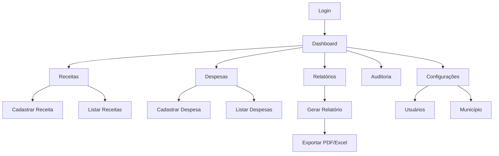

# PRD - KL Gestor Pub v1.4.0
**Product Requirements Document**

---

## 1. Product Overview

O **KL Gestor Pub** é um sistema web completo para gestão de contas públicas municipais, desenvolvido em Laravel com foco na transparência, eficiência e conformidade com as normas brasileiras de contabilidade pública. O sistema oferece controle detalhado de receitas e despesas através de uma arquitetura hierárquica de categorização, relatórios avançados e auditoria completa de operações.

O produto resolve os problemas de controle financeiro manual, falta de transparência e dificuldades na geração de relatórios que afetam a gestão pública municipal. Será utilizado por gestores públicos, contadores e auditores para administrar recursos públicos de forma eficiente e transparente.

## 2. Core Features

### 2.1 User Roles

| Role | Registration Method | Core Permissions |
|------|---------------------|------------------|
| Administrador | Criação manual pelo sistema | Acesso total: CRUD de usuários, categorias, receitas, despesas, relatórios e configurações |
| Operador | Convite por administrador | Acesso limitado: CRUD de receitas e despesas, visualização de relatórios |

### 2.2 Feature Module

O sistema KL Gestor Pub consiste nas seguintes páginas principais:

1. **Dashboard**: métricas financeiras em tempo real, gráficos comparativos, últimas transações
2. **Receitas**: cadastro, edição, listagem e controle de receitas municipais
3. **Despesas**: gestão completa de despesas com classificações específicas
4. **Categorias**: sistema hierárquico de categorização (Fonte → Bloco → Grupo → Ação)
5. **Relatórios**: geração de relatórios financeiros com filtros avançados e exportação
6. **Auditoria**: logs detalhados de todas as operações do sistema
7. **Configurações**: personalização por município e gestão de usuários

### 2.3 Page Details

| Page Name | Module Name | Feature description |
|-----------|-------------|---------------------|
| Dashboard | Métricas Financeiras | Exibir totais de receitas, despesas e saldo atual com comparação de períodos anteriores |
| Dashboard | Gráficos Interativos | Renderizar gráficos de linha para tendências e gráficos de categoria para distribuição |
| Dashboard | Últimas Transações | Listar as 5 transações mais recentes com tipo, valor e data |
| Receitas | Formulário de Cadastro | Criar receitas com validação de campos obrigatórios e seleção hierárquica de categorias |
| Receitas | Listagem e Filtros | Exibir receitas paginadas com filtros por período, categoria e valor |
| Receitas | Edição e Exclusão | Permitir modificação e remoção de receitas com log de auditoria |
| Despesas | Gestão de Despesas | CRUD completo com classificação específica e relacionamento com categorias |
| Despesas | Validação Avançada | Aplicar regras de negócio e validação de valores monetários |
| Categorias | Sistema Hierárquico | Gerenciar estrutura Fonte → Bloco → Grupo → Ação com relacionamentos dinâmicos |
| Categorias | Seleção Dinâmica | Carregar subcategorias via AJAX baseado na seleção do nível superior |
| Relatórios | Geração Personalizada | Criar relatórios por tipo (receitas, despesas, balanço) com filtros de período e categoria |
| Relatórios | Exportação | Gerar arquivos PDF e Excel com formatação brasileira |
| Auditoria | Logs de Sistema | Registrar e exibir todas as operações com usuário, ação, dados antigos e novos |
| Configurações | Gestão Municipal | Configurar dados do município, prefeito e informações institucionais |
| Configurações | Gestão de Usuários | CRUD de usuários com controle de roles e permissões |

## 3. Core Process

### Fluxo do Administrador:
1. **Login** → Dashboard com visão geral financeira
2. **Configuração Inicial** → Cadastrar dados do município e criar categorias base
3. **Gestão de Usuários** → Criar operadores e definir permissões
4. **Supervisão** → Monitorar operações através de relatórios e auditoria

### Fluxo do Operador:
1. **Login** → Dashboard com métricas atuais
2. **Registro de Receitas** → Cadastrar receitas com categorização adequada
3. **Controle de Despesas** → Registrar despesas com classificação específica
4. **Geração de Relatórios** → Criar relatórios para análise e prestação de contas

## 4. User Interface Design

### 4.1 Design Style

**Cores Principais:**
- Primária: #198754 (Verde institucional)
- Secundária: #6c757d (Cinza neutro)
- Sucesso: #28a745 (Verde claro)
- Perigo: #dc3545 (Vermelho)
- Aviso: #ffc107 (Amarelo)

**Estilo de Botões:**
- Botões arredondados com border-radius de 6px
- Efeitos hover suaves com transição de 0.3s
- Ícones FontAwesome para ações principais

**Tipografia:**
- Fonte principal: 'Segoe UI', Tahoma, Geneva, Verdana, sans-serif
- Tamanhos: 14px (corpo), 16px (títulos), 12px (legendas)
- Peso: 400 (normal), 600 (semi-bold), 700 (bold)

**Layout:**
- Sidebar fixa com navegação principal
- Cards com sombra sutil para agrupamento de conteúdo
- Tabelas responsivas com paginação
- Breadcrumbs para navegação hierárquica

**Ícones e Elementos:**
- FontAwesome 6 para ícones consistentes
- Badges coloridos para status e tipos
- Tooltips informativos em elementos complexos
- Loading spinners para operações assíncronas

### 4.2 Page Design Overview

| Page Name | Module Name | UI Elements |
|-----------|-------------|-------------|
| Dashboard | Cards de Métricas | Cards com ícones, valores em destaque, indicadores de variação percentual em verde/vermelho |
| Dashboard | Gráficos | Chart.js com cores institucionais, tooltips informativos, legendas claras |
| Receitas/Despesas | Formulários | Campos organizados em grupos, validação em tempo real, seleção hierárquica com dropdowns dinâmicos |
| Receitas/Despesas | Tabelas | DataTables com busca, ordenação, paginação, ações inline (editar/excluir) |
| Relatórios | Filtros | Formulário de filtros em sidebar, campos de data com datepicker, seleção múltipla de categorias |
| Relatórios | Visualização | Tabelas formatadas, gráficos integrados, botões de exportação em destaque |
| Auditoria | Timeline | Lista cronológica com badges de ação, detalhes expansíveis, filtros por usuário e período |
| Configurações | Abas | Interface em abas para diferentes seções, formulários organizados, validação visual |

### 4.3 Responsiveness

O sistema é **desktop-first** com adaptação completa para dispositivos móveis:

- **Desktop (>= 1200px)**: Layout completo com sidebar fixa
- **Tablet (768px - 1199px)**: Sidebar colapsível, cards reorganizados
- **Mobile (< 768px)**: Menu hambúrguer, tabelas com scroll horizontal, formulários em coluna única

**Otimizações Touch:**
- Botões com área mínima de 44px para toque
- Espaçamento adequado entre elementos clicáveis
- Gestos de swipe para navegação em tabelas
- Modais adaptados para telas pequenas

**Performance Mobile:**
- Lazy loading de gráficos e imagens
- Compressão de assets CSS/JS
- Cache de dados frequentemente acessados
- Otimização de consultas para conexões lentas